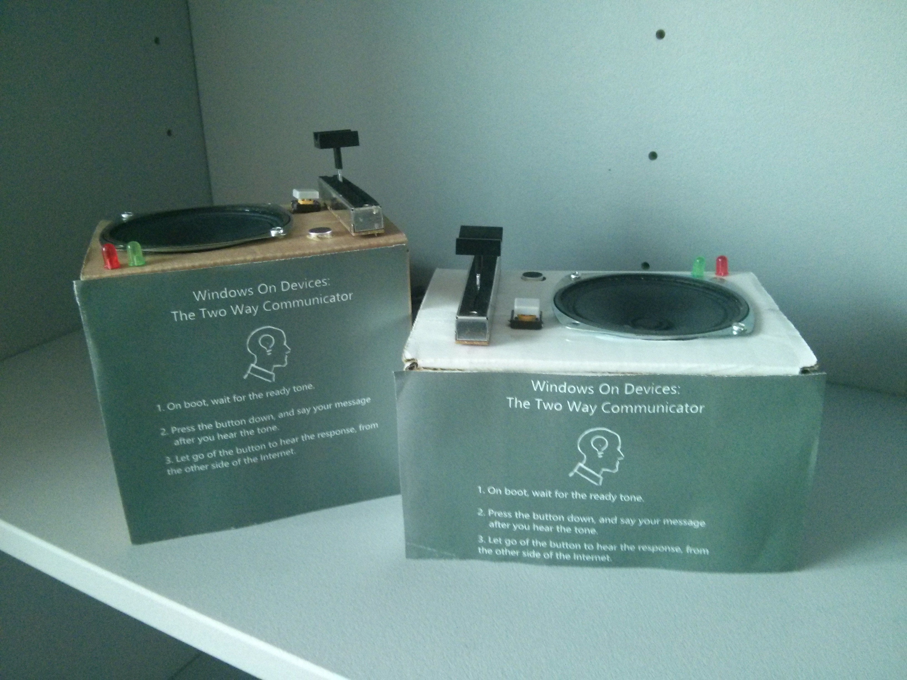
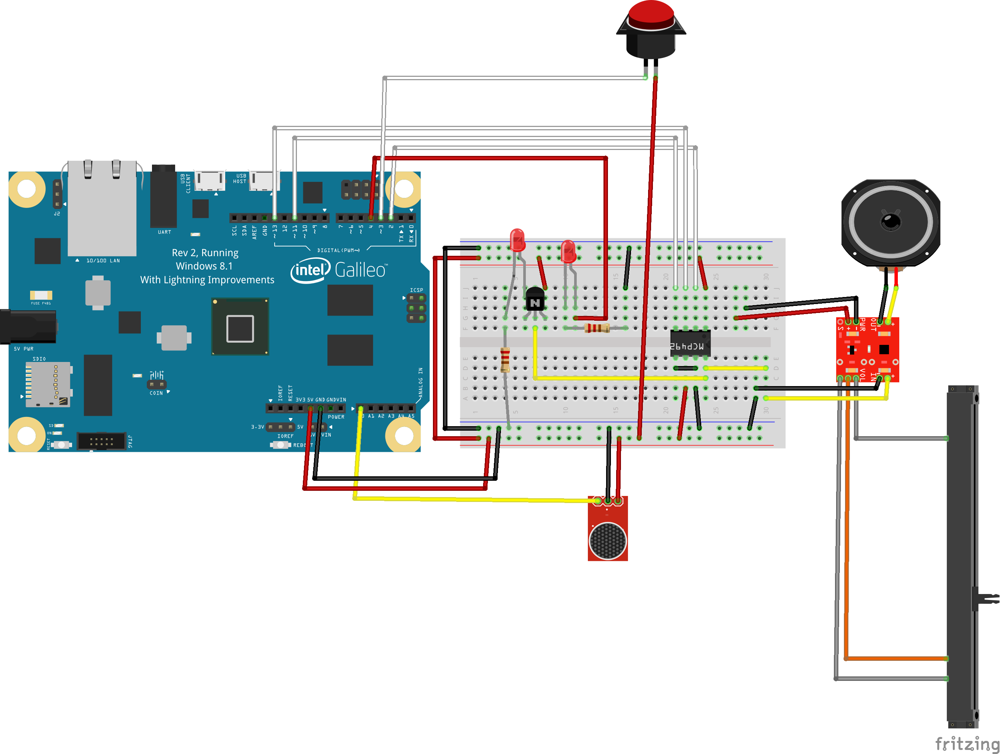

Windows on Devices Two-Way Communicator
===================

---------
**Content**
-------------

- [Components](#Components)
- [Hooking up Components](#hooking-up-components)
- [Run it!](#run-it!)
- [The Code](#the-code)
- [Playing Raw Audio](#raw-audio)
- [Streaming Data with Winsock Networking](#winsock-udp)

###**Components**

#### 1. TWO Intel Galileo Gen 2's running Windows with the latest Lightning improvements
You'll also need a 7 to 12V DC Power Supply (either a wall-powered supply, or a battery pack and appropriate cable.

Make sure the version of Windows you've got on your Galileo Gen2 has the latest LIGHTNING improvements to get the fastest output possible!

#### 2. An analog speaker And Audio Amplifier
We used an 4 Ohm speaker rated for 3W as our speaker, but any speaker should be fine as long as you make sure you're not overdriving anything. 

For our amplifier, we chose to use the [Mono-Audio Amp Breakout from Sparkfun](https://www.sparkfun.com/products/11044), which uses a Texas Instruments TPA2005D1. 

You can get by without an amplifier, but the audio volume will be lower, and you'll need to put together an appropriate driver circuit, since the MCP4291 DAC doesn't have the required output current to drive a speaker directly. You could end up blowing the chip if you try to drive the speakers directly from the DAC.

#### 3. Electret Microphone Breakout Board (or another Microphone)
Grab an Electret Microphone BoB from [Sparkfun](https://www.sparkfun.com/products/9964) or your own preferred part.

#### 3. SPI Compatible Digital-to-Analog Converter 
You'll also need a Digital-to-Analog Converter to convert the raw audio bytes, in [PCM](http://en.wikipedia.org/wiki/Pulse-code_modulation) to the appropriate Analog signals. 

We used the [MCP4921 from Microchip](http://www.microchip.com/wwwproducts/Devices.aspx?product=MCP4921), a 12bit DAC with SPI support. We recommend using this one unless you're comfortable modifying our code to account for the different control flow and data width. 

#### 4. Misc. Electrical Components:
Like any electronics project, you'll need plenty of wires/jumper cables, resistors of varying values (a trimpot if you want volume control), and at least a couple transistors. We used a couple [PN2222A's](https://www.fairchildsemi.com/datasheets/PN/PN2222A.pdf). 

#### 5. Development Tools
You'll need a laptop or desktop running Visual Studio 2013 or later with the correct nuget packages installed, as well as ethernet cables and a router so that all of your devices are connected on the same network.

###Hooking Up Components

Wire up each Galileo as follows:

1. Solder headers onto the Breakout Boards you're using. 
2. Solder leads onto the speaker you're using. 
3. Wire GP13 to SCLK on the MCP4921
4. Wire GP11 to SDAT on the MCP4921
5. Wire GP2 to /CS on the MCP4921
6. Wire A0 of the Galileo to AUD output of the Electret Microphone
7. Wire GP3 to one end of the button
8. Write GP4 to the positive lead of one of the LEDs
9. The other LED should have it's positive lead at the emitter of the transistor.
10. Wire Vcc and GND to the appropriate pins on your Breakout Boards, MCP 4921, and Transistors Collector/LEDs/Buttons as required.
11. Wire the output pins of the amplifier to the speakers.
12. Wire the input pins of the amplifier to the output of the MCP4921 and ground
13. Wire up the variable resistor, if you're using one, to the volume input of the Amplifier breakout board. Note that if you're using external volume control, you have to solder the jumper on the breakout. See the [Sparkfun Mono Amp Quickstart Guide](https://www.sparkfun.com/tutorials/392) for details.
13. Wire the output of the MCP4921 as the input of the base of the transistor. This will cause the LED to flash according to the audio playing.
14. Very carefully check your wiring, and then check it again, and then once more time to be safe. Shorts are an easy way to fry parts.

###Run it!

To run the project, deploy the application to each Galileo. You'll either need to comment out the PlayWav calls in RawAudio or make sure the appropriate WAV files exist
in C:\Communicator\aud on your Galileos.

The WAV files that the application will look for are named:

- "ready.wav" which signifies that the device is ready for communication.
- "record.wav" which signifies the device is in record mode.
- "waiting.wav" which signifies the device is in streaming mode. 

All WAV files should be 8 bit PCM encoded at an 8000kHz sampling rate (unless you modify the application). [Audacity](audacity.sourceforge.net) is an excellent open source application for editing audio files that can export files as 8bit 8kHz PCM WAV files. 

Note that your Galileo's should be named CommunicatorOne and CommunicatorTwo, or else you'll have to modify the names stored in Main.cpp

After deploying the applications, you should be able to run each one via Telnet or by [configuring your Galileo to run the application on startup](http://ms-iot.github.io/content/AdvancedUsage.htm).

The application will then go into search mode, trying to lookup it's partner. When the partner communicator is found by the application, it plays an alert notification, and goes into streaming mode.

Streaming mode will poll the socket for streamed audio clips, playing them as they are received. Pressing the button down moves the application into record mode, which samples input from the microphone and streams it to the partner Communicator. Letting go of the button goes back into receive mode. The audio cues stored in C:\Communicator\aud are used to indicate to the user what mode the application is in.

###The Code

There are several files in this project, the purpose of each is listed below.

- Main.cpp
- RawAudio.cpp and .h
- Communicator.cpp and .h
- MCP4921.h
- stdafx.h

**_Main_**
- The main function that initializes the basic program logic, and sets up the appropriate configuration for chip select and analog input pins.

**_RawAudio_**
- Handles all of the manipulation of WAV and Raw audio, as well as build up and teardown of network streaming. This class is configured to work only with 8kHz, 8-bit samples playing from WAV files.
- Recorded audio is sampled and played at a 16kHz rate. 

**_Communicator_**
- Wraps the UDP communication done using Winsock

**_MCP4921_**
- Holds several definitions for control bits for SPI communication between the Galileo and the MCP4921

**_stdafx_**
- Houses all of the external includes for the project

###Playing Raw Audio

####How are Audio files represented on a computer?
There are many ways audio files can be encoded and represented on a computer. This sample project can play Raw PCM encoded audio. WAV files are a good example of audio file that stores raw audio in the form of PCM, or Pulse Code Modulation. We recommend you check out the Wikipedia pages on the topics ([WAV](http://en.wikipedia.org/wiki/WAV), [PCM](http://en.wikipedia.org/wiki/Pulse-code_modulation)).
Essentially, these data bytes represent the loudness, or amplitude, of the audio signal at discrete points in time. 

####Recording and Playing Audio
All audio signals are made up of a combination of sine waves with different frequencies. In fact, human speech typically consists of waves that cycle between the range of 300Hz to 3400Hz (see [Wikipedia](http://en.wikipedia.org/wiki/Voice_frequency)). By taking samples of the loudness of these signals at a fast enough rate (defined by the [Nyquist-Shannon Sampling Frequency](http://en.wikipedia.org/wiki/Nyquist%E2%80%93Shannon_sampling_theorem)) we can
actually rebuild the signal by playing those audio samples out, onto a speaker, at the same rate. We convert the PCM bytes back into an Analog signal and feed it to our speaker to do this.

In our sample, we can use the Lightning improvements to sample our microphone at a very high rate. In our implementation, we sample the microphone at a 16kHz rate, so the reconstructed signal should clearly contains noises all the way up to 8kHz without distortion. 

Take a look through the code available in RawAudio.h and RawAudio.cpp to see how this was implemented. 

PS. What's discussed above are some of the fundamentals of [Digital Signal Processing](http://en.wikipedia.org/wiki/Digital_signal_processing), if it interests you, try making your own project that messes with signals to do something cool!

###Streaming Data with Winsock Networking

Streaming data and communicating over a Network is straightforward when using Windows. Take a look at Communicator.h and Communicator.cpp to see an example of simple UDP communication. For an in-depth discussion and more sample code, check out the documentation on [MSDN](http://msdn.microsoft.com/en-us/library/windows/desktop/ms738545(v=vs.85).aspx)